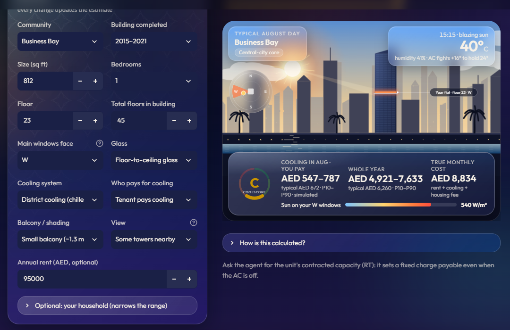
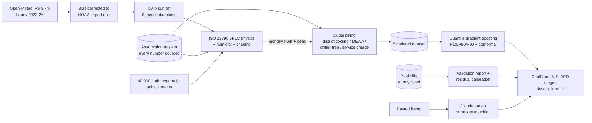
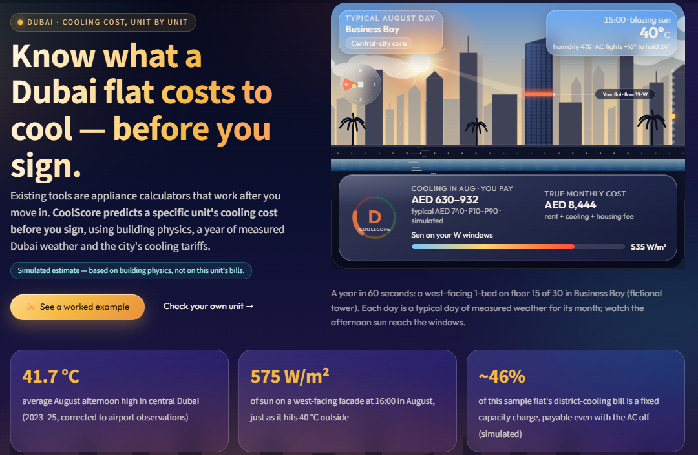
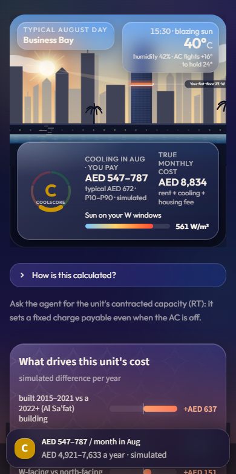
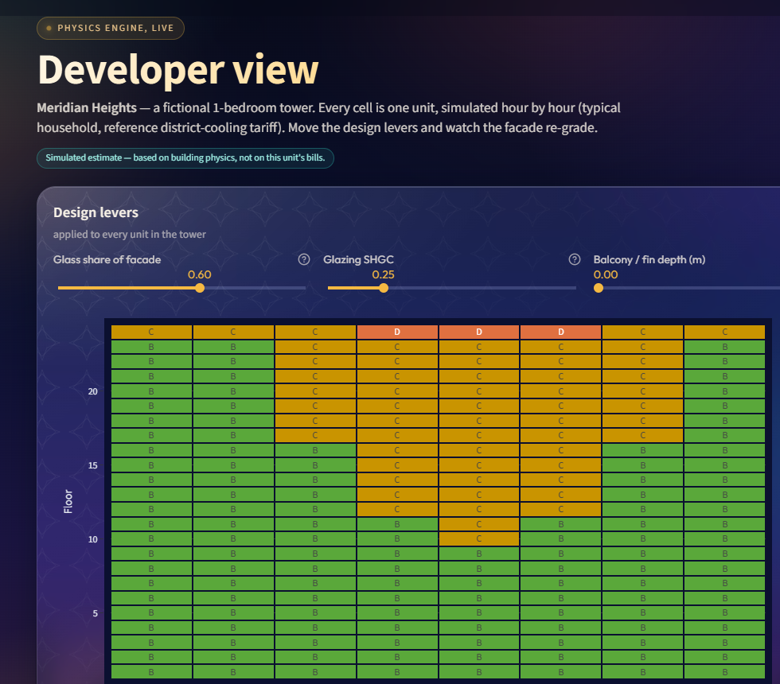
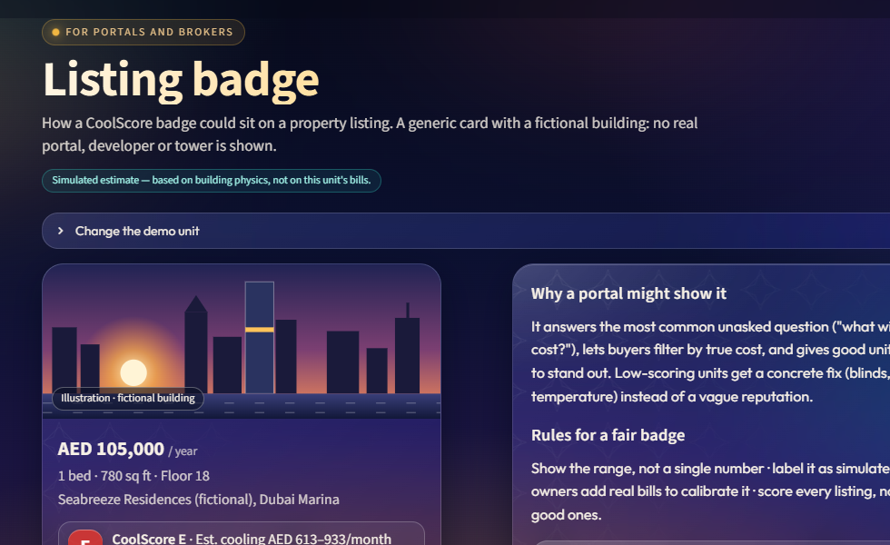

# CoolScore Dubai

**Know what a Dubai apartment will cost to cool *before* you rent or buy it.**

> Existing tools are appliance calculators that work after you move in. CoolScore predicts a specific unit's
> cooling cost before you sign, using building physics and Dubai's cooling tariffs.

**Live demo:** [coolscore-dubai.streamlit.app](https://coolscore-dubai-jvw959b8tqbsrazygcm7kk.streamlit.app/)
(try the [one-click example](https://coolscore-dubai-jvw959b8tqbsrazygcm7kk.streamlit.app/Check_a_Unit?example=1)) ·
**Demo video:** *[placeholder]* ·
**Try it locally in 2 minutes:** [How to run](#how-to-run)



*Check a Unit, live: a fictional listing read with no API key. The scene plays a typical August day of **measured**
Dubai weather. At 15:15 it is 40 °C and the sun is on this flat's west-facing windows (540 W/m²). Every figure is a
simulated estimate with a P10–P90 range, and it updates as you change any input.*

## In 60 seconds

- **Problem.** Cooling is one of the biggest costs of living in Dubai, and it varies a lot between units in the
  same tower. Listings show the rent, not the cost of living there.
- **Gap.** Every Dubai tool I found needs your contracted RT, your metered ton-hours or your AC's tonnage, so they
  only work after you move in ([competitive check](docs/competitive_landscape.md)).
- **Product.** Paste a listing and get a **CoolScore A–E**, a summer and winter monthly range, the annual range,
  the **true monthly cost** (rent + cooling + housing fee), the drivers in AED, and what-if controls.
- **How.** ISO 13790 hourly building physics on bias-corrected 2023–25 Dubai weather → Dubai billing (district
  cooling capacity + consumption, DEWA slabs, chiller-free) → 40,000 simulated units → quantile ML surrogate that
  answers in under a second.
- **Proof so far.** The surrogate reproduces the physics (R² 0.996). From listing facts alone it gets R² 0.94, with
  a calibrated 80 % range. **Real-bill accuracy is not yet measured**; the collection kit and an automatic
  validation report are ready.
- **Business.** Start with brokerage seats, then scale with a portal API. Next step: a 90-day pilot with one
  brokerage ([business model](docs/business_model.md), [pilot](docs/gtm_and_pilot.md)).

## The problem

Two flats in the same tower can have very different cooling bills: facing, floor, amount of glass, balcony shade,
neighbouring towers, building age, and above all the cooling contract. With district cooling there is a fixed
**capacity charge** that you pay even with the AC off, plus a consumption charge per ton-hour. Chiller-free deals
move that cost to the landlord. Tenants find out from their first summer bill. Brokers are asked "how much is the
chiller?" and answer from rules of thumb. Investors price chiller-free offers by feel.

In CoolScore's own simulation, an 800 sq ft 1-bed in a 2005–14 Business Bay tower (west-facing, lots of glass,
tenant pays district cooling) costs **AED 5,400–8,400 a year** to cool, and about **46 % of that is the fixed
capacity charge**.

## The gap

| What exists | When it works | Unit-specific? |
|---|---|---|
| Tariff and appliance calculators | After move-in: they need RT, ton-hours or AC tonnage | No |
| Cooling-provider calculators and apps | For existing customers, from actual consumption | No |
| Guides | Any time: rough averages by bedroom count | No |
| Project-level investment scores | Before buying, but they rate whole projects | No |
| **CoolScore** | **Before you sign, from listing facts** | **Yes** |

Abroad the pattern is proven: UK listings carry EPC energy-cost estimates, and a major US portal added energy-cost
estimates to listings. I found nothing that does it for Dubai or for district cooling. Sources, plus what I opened
versus only saw in a search snippet, are in [docs/competitive_landscape.md](docs/competitive_landscape.md).

## How it works



1. **Weather and sun.** Hourly ECMWF IFS 9 km weather from Open-Meteo, cached offline. The raw model ran 1.8 °C too
   cool at Dubai International (it misses the urban night heat), so temperature and dew point are corrected per
   month and hour against NOAA airport observations. On an unseen 2025 holdout, RMSE fell from 2.38 to 1.31 °C.
   Facade sun for 8 orientations comes from pvlib (Perez sky). [Evidence](docs/evidence/weather.md)
2. **Physics.** One apartment is one thermal zone, using the ISO 13790 simple hourly method (5R1C), vectorised in
   numpy. It covers walls, glass, roof exposure, thermal mass, a humidity (latent) load, balcony overhangs and
   shading from neighbouring towers, UAE weekend and optional Ramadan schedules, and AC habits. Building envelopes
   by era follow Dubai's rules (the 2003 insulation rules, the Green Building Regulations from 2014, Al Sa'fat). It
   is checked line by line against a literal ISO Annex C implementation (to 1e-6 W). [Evidence](docs/evidence/physics.md)
3. **Billing.** Published tariffs, each with its source in [config/assumptions.yaml](config/assumptions.yaml):
   district cooling capacity (AED per RT per year) + consumption (AED per RTh) + fuel surcharge + meter fee; a
   single-building plant under the regulator's caps; DEWA-billed AC with efficiency that drops in extreme heat,
   priced at the marginal DEWA slab; chiller-free; and cooling recovered through service charges. 5 % VAT is applied once.
4. **Surrogate.** 40,000 simulated unit-years train HistGradientBoosting quantile models on **only what a listing
   tells you**. Unknowns (exact glazing, air leakage, habits, weather year) stay hidden, so they become the range.
   Adding household details switches to a variant with a narrower range. [Model card](docs/model_card.md)
5. **AI layer.** With an `ANTHROPIC_API_KEY`, Claude (Haiku 4.5, structured output) reads the pasted listing and
   marks every field *found*, *inferred* or *missing*, quoting the evidence. Without a key, careful text matching
   does the same. Explanations are written from engine numbers only: a guard rejects any text containing a number
   the engine didn't produce.

## Accuracy (honest version)

Against **held-out physics simulations** (7,975 units the model never saw):

| Inputs | Target | R² | MAE | MAPE (bills > AED 500) | Inside P10–P90 |
|---|---|---|---|---|---|
| Listing facts only | Annual cost | 0.938 | AED 793 | 17.3 % | 80 % |
| Listing facts only | August | 0.940 | AED 87 | 12.8 % | 80 % |
| + household details | Annual cost | 0.949 | AED 717 | 15.5 % | 80 % |
| All simulation inputs (fidelity) | Annual cost | **0.996** | AED 162 | — | — |

- **Fidelity R² 0.996 meets the 0.95 target**: the ML reproduces the physics.
- **Listing-only R² 0.938 is below 0.95, by design.** A listing can't tell you the glass spec or how the household
  uses the AC. That uncertainty is real, so it is shown as the range rather than hidden.

**Validation against real bills: not yet done.** No real bills have been collected yet. The kit is ready: an
anonymised [bill template](data/real_bills/README.md) with a PII test, and a
[validation report](docs/validation_report.md) that runs automatically when bills are added (MAE, MAPE, share
within ±20 %, residual calibration).

**Sanity check against a published rough band** (one independent guide, unverified): simulated typical 1-bed and
2-bed bills fall inside its ranges. Studios come out slightly low and 3-beds slightly high. Both are reported as is.

**Physics sanity checks** (all tested): in summer, east and west facades get about 1.8× the sun of south or north,
and west sun lands in the hottest hours (+34 % vs east above 38 °C). North-facing units cost least. More glass, a
lower AC setpoint, less shading and a top floor all raise the load. A finding I report rather than tune away: west
≈ east in annual cooling energy, because west's penalty shows up in peak load.

## The app

Seven pages in a Dubai "liquid glass" design (frosted panels over a dusk backdrop), phone-friendly, with every figure
behind a "How is this calculated?" expander.

**The live climate scene** (`app/components/climate_stage/`) is the centrepiece. It's a custom Streamlit component in
plain SVG and JavaScript, with no animation library and no network calls. It plays a typical day of measured weather for
the chosen month (`data/demo/climate_monthly.json`, from the 2023–25 hourly data):
- The sun follows Dubai's real sun path.
- The sky warms with the real temperature, haze follows humidity and dust, and clouds follow cloud cover.
- The unit's windows glow, and a beam reaches them, when the facade data says the sun is really on that side.
- The scene matches the community: sea for coastal areas, a canal for central ones, dunes inland.
- Floor, glass, balcony and neighbouring towers redraw as you change them.

Because the component persists across reruns, changes glide instead of reloading. It respects
`prefers-reduced-motion`.

| Page | What it answers |
|---|---|
| **Check a Unit** | Paste a listing or fill a form; everything updates live (no submit). CoolScore, the selected month's and the annual range, true monthly cost, the live climate scene, drivers in AED, a heat-coloured monthly chart, what-if (floor, facing, AC temperature, chiller-free), plain-language explanation and questions to ask the agent |
| **Compare Units** | 2–4 units side by side; flags when the cheaper rent is the more expensive home |
| **Investor View** | Net yield after cooling and service charges; the rent premium a chiller-free offer must earn |
| **Developer View** | Facade heatmap of a fictional tower (floors × directions) and AED impact of glass ratio, glazing and balcony depth, per unit and for the whole tower (runs the physics engine directly) |
| **Listing Badge** | A generic, unbranded listing card with "CoolScore B · Est. cooling AED X–Y/month" |
| **Business Case** | Interactive pricing, unit economics and 12-month P&L |
| **Methodology** | Physics, data, accuracy, real-bill status, the full assumptions register, limitations |

<p>
  
  
</p>
<p>
  
  
</p>

## Business case

| Option | Price (assumption) | Verdict |
|---|---|---|
| Brokerage subscription | AED 149 per agent seat per month | **Start here**: brokers get the AC question weekly, decide fast, and a pilot produces the proof portals will want |
| Portal API licence | AED 1.50 per scored listing per month | **Scale channel** once validated |
| Developer design reports | AED 35,000 per project | Opportunistic, high margin |
| Consumer report | Free score, AED 29 detailed report | Free, for distribution and opt-in bill sharing |

Scoring costs about AED 0 per listing (a model lookup). Optional AI parsing costs about AED 0.02. In the default
12-month plan (founder unpaid, every input adjustable on the Business Case page), revenue is about **AED 353k** and
the plan **breaks even in month 9**. Every number is a labelled PROPOSAL in the assumption register, not market data.
Full reasoning: [docs/business_model.md](docs/business_model.md).

## Pilot offer

> For 90 days we score 60–120 of one brokerage's active rental listings: badge vs matched controls, a one-page unit
> report agents can send, and an answer to "how much is the AC?". We measure enquiries per listing, lead quality,
> days to let and agent trust, and collect 45+ anonymised bill-months. Pilot fee **AED 15,000** (assumption;
> waivable for data and a case study).

Metrics are fixed before the start: [docs/gtm_and_pilot.md](docs/gtm_and_pilot.md).

## API

FastAPI service with the same model: `POST /score`, `POST /compare`, `GET /health`. Interactive OpenAPI docs are
at `/docs`.

```bash
python tasks.py api
```

```bash
curl -s -X POST http://127.0.0.1:8000/score -H "Content-Type: application/json" -d '{"community": "Business Bay", "size_sqft": 800, "bedrooms": 1, "floor": 15, "total_floors": 30, "facing": "W", "era_band": "2005_2014", "system": "district_cooling", "payer": "tenant", "annual_rent_aed": 95000}'
```

```json
{
  "coolscore": "D",
  "cost_intensity_aed_per_sqft_year": 8.215,
  "annual_aed": {"p10": 5314, "p50": 6662, "p90": 8267},
  "summer_month_aed": {"p10": 615, "p50": 725, "p90": 920},
  "winter_month_aed": {"p10": 250, "p50": 363, "p90": 498},
  "true_monthly_cost_aed": 8868,
  "drivers": [{"driver": "built 2005–2014 vs a 2022+ (Al Sa'fat) building", "aed_per_year": 1018},
              {"driver": "W-facing vs north-facing", "aed_per_year": 216}],
  "landlord_annual_aed_p50": 5738,
  "formula": "District cooling = capacity (contracted RT × AED 750/yr, ...",
  "assumed_fields": ["glass", "balcony", "obstruction"],
  "simulated": true,
  "disclaimer": "Estimates for guidance only — not a quote from DEWA or any cooling provider."
}
```

*(Values rounded here; the API returns full floats.)* `POST /compare` takes `{"units": [...]}` with 2–4 units and
adds `cheaper_rent_is_more_expensive_home`.

## How to run

**Windows, one click:** double-click **`Start CoolScore.cmd`**. The first run sets up Python (a few minutes, once).
After that the app starts in about 3 seconds and opens in your browser. Keep the black window open while you use
it, and close it to stop. Double-clicking again while the app is running just reopens the page.

**Any OS, by hand:** Python 3.11+ (built and tested on 3.13). `tasks.py` works on Windows, macOS and Linux; the
`Makefile` wraps it.

```bash
python -m venv .venv
```

```bash
.venv/bin/python tasks.py setup
```

On Windows use `.venv\Scripts\python.exe` instead of `.venv/bin/python`. Then:

| Command | What it does | Time |
|---|---|---|
| `python tasks.py launch` | Start the app and open it in the browser (what the `.cmd` runs) | ~3 s |
| `python tasks.py app` | Streamlit app at http://localhost:8501 (uses the committed model) | instant |
| `python tasks.py api` | FastAPI at http://127.0.0.1:8000/docs | instant |
| `python tasks.py test` | 169 pytest tests | ~2 min |
| `python tasks.py data` | Re-fetch and correct weather, facade sun (network) | ~30 s |
| `python tasks.py simulate` | 40,000 scenarios through physics + billing | ~4 min |
| `python tasks.py train` | Surrogate, quantiles, conformal calibration, A–E bands | ~2 min |
| `python tasks.py validate` | Real-bill validation report | seconds |
| `python tasks.py assumptions` | Regenerate [docs/assumptions.md](docs/assumptions.md) from the YAML | instant |
| `python tasks.py climate` | Rebuild the typical-month climate file the live scene plays (after `data`) | ~4 s |

The full pipeline (`data → simulate → train`) takes about 7 minutes on a laptop. The app never calls an external
API at runtime except the optional Claude parser.

**Optional AI features:** set `ANTHROPIC_API_KEY` in the environment or in `.streamlit/secrets.toml` (see
`.streamlit/secrets.toml.example`). Without it the app uses text matching and template explanations, at zero cost.

**Deploying to Streamlit Community Cloud:** main file `app/Home.py`, Python 3.13 (Advanced settings), and
optionally the `ANTHROPIC_API_KEY` secret. The model and weather files are committed (about 15 MB in total). The
Developer View builds its facade-sun cache on first use (about 5 s). Open-Meteo's free tier is for non-commercial
use, which suits a portfolio demo; a commercial launch needs its paid plan.

## Repo map

```
config/      assumptions.yaml (every real-world number + source) · archetypes · communities · settings
data/        raw/ weather cache · demo/ model artifact · real_bills/ template · simulated/ (regenerable)
src/coolscore/  weather · physics · billing · simulate · model · validation · assistant
app/         Streamlit Home.py + 7 pages      api/   FastAPI      tests/   169 tests
docs/        prd · competitive_landscape · user-research/ · business_model · gtm_and_pilot · pitch_deck
             interview_prep · model_card · methodology · assumptions · evidence/ · validation_report
```

## Limitations

- **Simulated, not measured.** Until real bills arrive, accuracy means accuracy against physics, not reality.
- **Contracted capacity** (the fixed district-cooling charge) is estimated from unit size from secondary sources;
  real allocations vary and can dominate the bill. The app tells you to ask for the unit's RT.
- One-zone apartment model; neighbours assumed conditioned; reflections from glass towers ignored.
- 9 km weather grid corrected to airports; sea breezes and street canyons are not resolved.
- Behaviour (AC temperature, blinds, leaving the AC on) can move a bill more than the building does. It is sampled,
  not observed.
- Tariffs change (the fuel surcharge monthly). 61 of 66 assumption records are still marked `verify: true`; see
  [docs/assumptions.md](docs/assumptions.md).
- User interviews are designed ([kit](docs/user-research/README.md)) but not yet run; no findings or quotes are
  claimed.

---

Sandeep Gadakari · Civil engineer + MBA (Finance & Business Analytics) · Duke AI Product Management ·
[linkedin.com/in/sandeep-gadakari](https://linkedin.com/in/sandeep-gadakari/) ·
[github.com/sandeepgadakari2000](https://github.com/sandeepgadakari2000)

Weather data by [Open-Meteo.com](https://open-meteo.com/) (CC BY 4.0); observations from NOAA NCEI ISD. Building
and listing names in the app are fictional.

*Estimates for guidance only — not a quote from DEWA or any cooling provider.*
