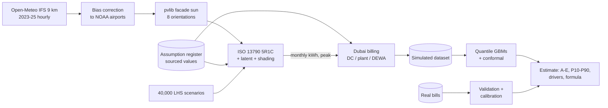

# Methodology

How CoolScore turns a listing into a cooling-cost range. Detailed evidence lives in `docs/evidence/`
(weather validation and facade sun; physics checks and orientation effects), the surrogate in `model_card.md`,
every number's source in `assumptions.md`.

## 1. Weather and sun

- **Source:** Open-Meteo Historical Weather API, ECMWF IFS 9 km, hourly 2023–2025 (CC BY 4.0; free tier is
  non-commercial). ERA5 was rejected: at 0.25° it puts all three sites in one grid cell.
- **Validation:** against NOAA ISD hourly observations at Dubai International and Al Maktoum. Raw IFS ran 1.8 °C
  cool at Dubai International (evening and night urban heat; cooling degree-hours 0.80× observed).
- **Correction:** additive per (month, hour) on temperature and dew point; RH recomputed. On the unseen 2025
  holdout at Dubai International: RMSE 2.38 → 1.31 °C, cooling degree-hours 0.81 → 1.02× observed. Inland dew-point
  correction did not carry over to 2025 (reported).
- **Microclimates:** coastal ≈ central after correction (~1 % CDH), so coastal communities use central weather;
  inland stays separate (~13 % fewer CDH).
- **Facade sun:** pvlib solar position (preceding-hour radiation → mid-interval geometry, verified to 0.3 %), Perez
  sky diffuse, ground reflection at runtime from an albedo range. Summer: E/W ≈ 1.8× S or N; west sun coincides
  with the hottest hours; winter: south highest.

## 2. Physics (one apartment = one zone)

- ISO 13790:2008 simple hourly method (5R1C, Annex C), vectorised in numpy across units; verified against a literal
  line-by-line Annex C implementation (≤ 1e-6 W) and an analytic steady state.
- Envelope: one or two facades by orientation, window-to-wall ratio, glazing U/SHGC (F_w 0.90, frame 0.20), opaque
  walls with sol-air absorption and sky radiation, roof for top floors; neighbours adiabatic.
- Archetypes by completion era: A1 pre-2005 (uninsulated block U 1.65, single tinted glass), A2 2005–14 (2003 rules,
  frame thermal bridges), A3 2015–21 (Green Building Regulations limits, compulsory from 2014), A4 2022+ (Al Sa'fat:
  same limits plus thermal-bridge and air-tightness rules).
- Shading: balcony as overhang (profile angle), neighbouring towers as a horizon angle that falls with height; both
  reduce beam and sky-diffuse sun.
- Air and moisture: infiltration and untreated ventilation (ASHRAE 62.2 based) at outdoor conditions; centrally
  pre-treated fresh air excluded from the unit meter; latent load against Al Sa'fat's 50 % RH design point.
- Gains and behaviour: ASHRAE occupant gains, ISO 13790 residential appliance profile, away/home schedules with the
  UAE Saturday–Sunday weekend and Friday half day, optional Ramadan schedule, away-mode (keep/setback/off), window
  opening in mild weather.
- Invariants tested: more glass ↑, west > north in summer, higher setpoint ↓, more shading ↓, top ≥ mid floor,
  no sun ↓ (plus people ↑, corner ↑, AC-off ↓, latent follows humidity).

## 3. Billing (Dubai-specific)

| System | Formula | Sources |
|---|---|---|
| District cooling | contracted RT × AED 750/yr (per day in month) + RTh × 0.568 + RTh × 0.075 fuel + meter fee + fans on DEWA; VAT 5 % | Empower charges page; RSB RD10 caps |
| Single-building plant | RTh × up to 0.80 + 0.075 fuel; no capacity charge | RSB RD10 |
| DEWA split / central AC | (kWh_th + derate × Σ load·(T−35)⁺) ÷ COP, priced at the marginal DEWA slab + 0.060 fuel; VAT 5 % | DEWA slab page (Oct 2026), Al Sa'fat EER 9.5 → 6.6 (35 → 46 °C) |
| Chiller-free | Landlord pays the provider bill; tenant pays fan electricity | Empower; RD10 |
| Service charge | Owner pays (estimated with the same tariff); tenant pays fans | Assumption |

Contracted RT = max(size ÷ sq ft per RT, simulated design peak); sq ft per RT (150–300) is a labelled modelling
assumption from secondary sources and the largest single uncertainty in district-cooling bills.

## 4. Surrogate, ranges and the grade

See `model_card.md`: 40,000 Latin-hypercube scenarios, quantile gradient boosting on what a listing tells you,
conformal calibration (80 % coverage), standardised A–E bands, counterfactual drivers (switch one feature to a
reference: north-facing, mid floor, medium glass, open view, no balcony, 2022+ envelope).

## 5. Validation loop

`python tasks.py validate` (also run by the app) rebuilds each billed unit from the bill's anonymised facts, runs
physics + billing for the bill's months, and compares consumption, capacity charge and total bill (MAE, MAPE,
share within ±20 %, bias). With 12+ months per system it writes a residual calibration factor. Today: no real bills,
so real-world accuracy is **not yet validated**. A published rough band agrees for typical 1-bed and 2-bed units.

## 6. Limitations

Simulated until bills arrive; contracted capacity estimated; one-zone model; 9 km weather grid; behaviour sampled,
not observed; tariffs change (fuel surcharge monthly); provider tariffs other than the reference may differ.
