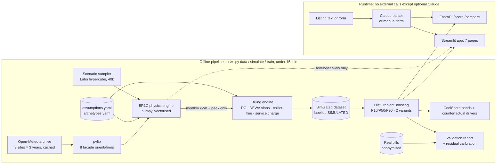

# Phase 0 plan: CoolScore Dubai

*2026-10-03 · for Sandeep's approval before any product code is written*

## 1. What gets built, in one picture

**Key design choices**

1. **Physics and billing are separate stages.** The slow part (physics) is cached as monthly energy per scenario. When a tariff changes, only re-billing and retraining run (minutes). The brief's rule that every number lives in `assumptions.yaml` stays cheap to honour.
2. **Two accuracy numbers, not one.** A model given *all* simulation inputs measures how well ML imitates the physics. The brief's R² ≥ 0.95 target applies there. A model given *only listing facts* can't beat the hidden variation (glazing spec, behaviour, weather year), so it gets an honest R², MAE, MAPE and P10–P90 coverage. I'll explain this in `model_card.md` so the gap doesn't look like failure. (**Decision D2**)
3. **The CoolScore label measures the unit, not the contract.** The A–E grade uses a *standardised* cost: reference household, 24 °C, reference district-cooling tariff, typical weather. A chiller-free unit with west-facing glass is still an "E" building that is cheap *for the tenant*. The AED figures beside the score show what this user actually pays. This works like a UK EPC. (**Decision D1**)
4. **Memory rule:** the engine loops over 8,760 hours with numpy vectors across about 5,000 units per batch. It keeps only monthly sums and the peak, and never stores hourly arrays.

## 2. Data schemas

### 2.1 Unit input (shared by form, parser, API and app: `src/coolscore/schemas.py`, pydantic)

| Field | Type / values | Tier | Default if missing |
|---|---|---|---|
| `community` | name from `communities.yaml` | Listing | required |
| `building_era_band` | `before_2005` / `2005_2014` / `2015_2021` / `2022_plus` | Listing | ask; else widest range |
| `cooling_system` | `district_cooling` / `dewa_split_ac` / `dewa_central_ac` / `building_central_plant` | Listing | ask |
| `cooling_payer` | `tenant` / `landlord_chiller_free` / `service_charge` | Listing | `tenant` |
| `size_sqft` | 250–6,000 | Listing | required |
| `bedrooms` | 0–5 (0 = studio) | Listing | required |
| `floor`, `total_floors` | int, 1 ≤ floor ≤ total ≤ 100 | Listing | ask |
| `facing` | `N NE E SE S SW W NW`, corner = two adjacent | Listing | ask; direction helper |
| `glass_amount` | `low` / `medium` / `high` / `floor_to_ceiling` | Listing | `medium` (flagged) |
| `balcony` | `none` / `small` / `deep` | Listing | `none` (flagged) |
| `view_obstruction` | `open` / `partial` / `heavy` | Listing | `partial` (flagged) |
| `annual_rent_aed`, `price_aed` | number | Listing | optional |
| `household_size` | 1–8 | Optional detail | hidden variation |
| `occupancy` | `away_daytime` / `home_daytime` | Optional detail | hidden variation |
| `setpoint_c` | 20–28 | Optional detail | hidden variation (default display 24) |

Every defaulted field is shown as "assumed — please confirm". Nothing is silently guessed.

### 2.2 Hidden variables (sampled in simulation, never asked)

Glazing U-value and SHGC within the era range · wall and roof U within the era range · infiltration rate · internal-gain intensity · blind/curtain use · AC efficiency (DEWA cases) · contracted DC capacity factor · fresh-air pre-treatment by the building (yes/no) · unit depth · weather year. In the listing-only model variant, household size, occupancy and setpoint are hidden too.

### 2.3 Other tables

| Table | Grain | Key columns |
|---|---|---|
| `data/raw/openmeteo_<site>_<year>.csv.gz` + `.meta.json` | site-hour | time (Asia/Dubai), temp, RH, dew point, pressure, wind, GHI, DNI, DHI · meta: URL, model, retrieved date, licence |
| `data/raw/facade_<site>_<year>.csv.gz` | site-hour | per orientation: beam, sky diffuse, ground-reflected (W/m²), incidence angle, profile angle |
| `data/simulated/scenarios.csv.gz` | scenario | inputs + hidden + `kwh_th_m01..m12`, `peak_kw_th`, `kwh_fan_m01..m12`, `kwh_e_m01..m12` (DEWA AC) |
| `data/simulated/billed.csv.gz` | scenario | per-month AED components (capacity, consumption, fuel, fees, VAT), tenant total, landlord total, standardised score cost |
| `data/real_bills/*.csv` | unit-month | see `data/real_bills/README.md` (already created) |
| Parser output | listing | per field `{value, status: found / missing / inferred, evidence: "quoted text"}` |
| API `/score` response | unit | score, P10/P50/P90 monthly (peak, low) and annual, true monthly cost, drivers[], formula text, `simulated: true` |

## 3. Building archetypes (values researched in Phase 2, all `verify: true`)

Bands are by **completion year**. The cut-offs follow Dubai's envelope rules (early insulation requirements → Green Building Regulations, mandatory for new buildings from 2014 → Al Sa'fat from 2020). The edges allow for a typical permit-to-completion lag. The bands are a design choice. The regulation dates behind them are sourced facts, kept as `regulation_milestones` in `config/archetypes.yaml`, and the edges get revisited once those dates are confirmed.

| Archetype | Completion band | Typical form (qualitative, to verify) | Parameters to source |
|---|---|---|---|
| A1 Older low/mid-rise | before 2005 | Concrete block, little insulation, smaller tinted windows, often DEWA-billed split/central AC | wall U, roof U, glazing U/SHGC, typical WWR, infiltration |
| A2 Boom-era glass high-rise | 2005–2014 | Curtain wall or high glass ratio, tinted/reflective double glazing, mostly district cooling | same |
| A3 Green Building Regulations era | 2015–2021 | Mandatory envelope limits, double low-e glazing | same, from DM regulation tables |
| A4 Al Sa'fat era | 2022+ | Silver Sa'fa minimum envelope and glazing limits | same, from Al Sa'fat tables |

Shared parameters: thermal mass class (ISO 13790 medium/heavy), floor-to-floor height, unit depth range, frame fraction.

## 4. Scenario ranges (simulation design choices, not facts)

| Variable | Sampling range | Notes |
|---|---|---|
| Microclimate × weather year | 3 sites × 2023, 2024, 2025 | Sites from `communities.yaml` |
| Era archetype | A1–A4 | Weighted towards the likely stock mix (assumption) |
| Size by bedrooms | studio 300–650 · 1BR 550–1,100 · 2BR 900–1,700 · 3BR 1,300–2,600 · 4–5BR 2,000–4,500 sq ft | Check against what you see in listings |
| Floors | total 4–15 (A1), 10–80 (A2–A4); floor uniform 1..total | Top floor gets roof exposure |
| Facing | 8 directions, about 25% corner (two adjacent facades) | |
| Glass (WWR) | low 0.15–0.30 · medium 0.30–0.50 · high 0.50–0.70 · floor-to-ceiling 0.70–0.90 | |
| Balcony depth | none 0 · small 1.0–1.6 m · deep 1.8–3.0 m | Acts as an overhang |
| Obstruction | open / partial / heavy → horizon angle and sky-view factor, reduced with height | |
| Household | 1–6 people; away or home in the daytime | UAE Sat–Sun weekend; Ramadan dates from config |
| Setpoint | 21–27 °C | Display default 24 °C |
| Cooling system / payer | DC (tenant / chiller-free / service charge), DEWA split, DEWA central | |
| Count | **40,000**, 20% held out (stratified by microclimate) | About 1 minute of physics; well under the 15-minute budget |

## 5. Assumptions you must verify (`config/assumptions.yaml`, all `value: null` until researched)

| # | Assumption | Phase | Where I'll look first |
|---|---|---|---|
| 1 | DEWA residential slab rates and thresholds | 3 | [DEWA slab tariff page](https://www.dewa.gov.ae/en/consumer/billing/slab-tariff) |
| 2 | DEWA fuel surcharge per kWh | 3 | DEWA |
| 3 | DC consumption rate (AED/RTh) | 3 | [Empower charges page](https://www.empower.ae/customer-care/charges-explanation/); Dubai regulator (RSB) for district cooling |
| 4 | DC capacity/demand charge (AED/RT/yr) | 3 | same. Blogs quote figures but cite nothing, so I won't use them as sources |
| 5 | DC fuel surcharge (whether it applies, and how) | 3 | provider and regulator |
| 6 | DC meter/admin fees | 3 | provider |
| 7 | VAT 5% on cooling and electricity | 3 | Federal Tax Authority |
| 8 | **Contracted capacity per unit** (RT per sq ft, or from peak load) | 3 | Your real bills (`contracted_capacity_rt`) are the best source |
| 9 | Other DC providers' tariffs | 3 | provider sites |
| 10 | Baseline non-cooling household kWh (for marginal DEWA slabs) | 3 | DEWA/RSB consumption statistics |
| 11 | AC efficiency (UAE minimum EER, star ratings), COP drop in heat, FCU fan power | 3 | ESMA/MoIAT standards, manufacturer data |
| 12 | Envelope U-values and SHGC per era | 2 | DM Green Building Regulations, Al Sa'fat tables, peer-reviewed UAE studies |
| 13 | Infiltration rates; fresh-air pre-treatment prevalence | 2 | UAE literature, ASHRAE |
| 14 | Internal gains: people (sensible/latent), appliances, lighting | 2 | ASHRAE Fundamentals |
| 15 | Ramadan dates 2023–2025; UAE weekend | 2 | official calendars |
| 16 | Ground albedo | 1 | literature |
| 17 | Orientation effect size (west versus north) | 2 | published UAE studies (sanity check only) |
| 18 | Typical bills by bedroom count | 8 | reputable guides (rough bands only) |
| 19 | Service charges (AED/sq ft/yr) | 5/8 | Dubai Land Department service-charge index |
| 20 | Open-Meteo terms: free tier is **non-commercial**, data CC BY 4.0 | 1 | [terms](https://open-meteo.com/en/terms). Fine for a portfolio; a commercial product needs a paid plan or ERA5 direct |

## 6. Top risks and mitigations

| # | Risk | Impact | Mitigation |
|---|---|---|---|
| 1 | No ground truth: everything is simulated until bills arrive | Credibility | Bill kit now; sanity bands; the "simulated" label everywhere; validation status shown in the app |
| 2 | **Capacity charge dominates** district-cooling bills, so the unit physics moves the total less than people expect | The core claim weakens | Model contracted capacity explicitly; report the energy-driven and fixed parts separately; "ask the agent: what is the contracted RT?" |
| 3 | What the unit meter measures (FCU only versus fresh-air load handled centrally) | Bias, likely ±20–40% on consumption | Hidden variable for fresh-air pre-treatment; check against bills |
| 4 | Tariffs differ by provider and building (sub-metering companies) | Wrong AED | Tariff profile selectable; editable "my bill says" overrides in the UI |
| 5 | Weather grid too coarse to separate coastal from central sites | False precision | Phase 1 compares ERA5 (~25 km) with ECMWF IFS (~9 km); if the sites don't differ, collapse them and say so |
| 6 | Listing-only accuracy well below R² 0.95 | Looks like failure | Separate fidelity from predictive accuracy (D2); show ranges; optional details narrow the range |
| 7 | 5R1C simplifies a glass-heavy tower unit | Systematic error | Invariant tests; compare the orientation effect and the kWh/m² range with published UAE studies; document limits |
| 8 | Brokers and landlords resist scores that make listings look worse | Adoption | Interview probes; badge framed as "true cost" with ranges; opt-in pilot design in `gtm_and_pilot.md` |
| 9 | Model artifacts too big for Streamlit Cloud | Deploy fails | Budget under 50 MB; fewer, smaller models; check in Phase 4 |
| 10 | LLM invents numbers in explanations | Trust | Numbers passed in as data; post-check rejects any number not in the engine output; template fallback |

## 7. Phase plan (each ends with tests → PROGRESS.md → commit → summary of 10 lines or fewer → wait for "go")

| Phase | Output | Exit test |
|---|---|---|
| 1 Weather + sun | Cached weather, facade irradiance, sanity plots | E/W > S in summer; west peak coincides with the hottest hours; cache reload offline |
| 2 Physics | 5R1C, single unit → vectorised; archetypes sourced | 6 invariants in brief §9; orientation effect versus literature |
| 3 Billing | All four systems with sourced tariffs | Components sum; capacity charge at zero use; VAT once; chiller-free split |
| 4 Simulation + model | 40k dataset, quantile models, drivers, bands, model card | Fidelity R²; coverage; monotonic bands; seed reproducibility |
| 5 App core | Check, Compare, Investor, Methodology | Smoke tests; under 3 s per answer |
| 6 Developer View, Badge, API | Facade heatmap, badge card, FastAPI | API contract tests |
| 7 AI layer | Parser, direction helper, explanations, no-key fallback | Schema test; missing-field flags; number-guard test |
| 8 Business | Bill validation report, all §8 docs, Business Case page | Report runs on the sample; numbers trace to assumptions |
| 9 Ship | README, 25+ tests, deploy prep | Definition of done §12 |

## 8. Decisions I need from you

| # | Decision | My recommendation |
|---|---|---|
| D1 | CoolScore grade basis | **Standardised** (unit only); AED shown separately for the actual payer |
| D2 | Accuracy reporting | **Fidelity R² ≥ 0.95** (all inputs) as the target; listing-only metrics reported honestly next to it |
| D3 | Dataset file format | **CSV.gz** (no extra dependency). Parquet needs pyarrow, which Streamlit already installs, but it's your call |
| D4 | Task runner | **`python tasks.py <task>`** (Windows has no `make`), plus a thin `Makefile` for Mac/Linux |
| D5 | Commit authorship | Commit as you, **without** a Claude co-author line, as on your other portfolio repos. Say if you want it added |
| D6 | GitHub | Local git only for now; you create the remote (public for portfolio?) when ready |
| D7 | Pitch deck PDF | Marp isn't installed; in Phase 8 I'd ask to run it via `npx @marp-team/marp-cli` (Node is present) |
| D8 | Microclimates | Keep 3 unless Phase 1 shows they're indistinguishable |

## 9. Machine notes

- Repo: `Desktop\coolscore`. The virtual environment lives **outside OneDrive** at `C:\Users\sande\.venvs\coolscore` (Python 3.13.x). All allowed dependencies installed cleanly; versions are pinned in `requirements.txt`.
- Nothing from the Argus repo is used or changed.
